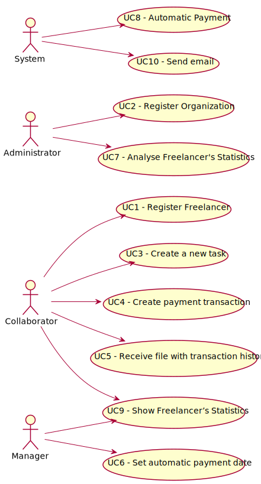

# Diagrama de Casos de Uso



**Para cada caso de uso deve ser realizada a sua descrição (perspetiva de engenharia de requisitos) e a sua realização (perspetiva de design).**

# Casos de Uso
| UC  | Descrição                                                               |                   
|:----|:------------------------------------------------------------------------|
| UC1 | [Register Freelancer](usecases/UC1/UC01_RegisterFreelancer.md)   |
| UC2 | [Register Organization](usecases/UC2/UC2_RegisterOrganization.md)|
| UC3 | [Task Creation](usecases/UC3/UC03_TaskCreation.md)|
| UC4 | [Create payment transaction](usecases/UC4/UC4_CreatePaymentTransaction.md)|
| UC5 | [Receive file with transaction history](usecases/UC5/UC5_ReceiveFileWithTransactionHistory.md) |
| UC6 | [Set automatic payment date](usecases/UC6/UC06_SetAutomaticPaymentDate.md)|
| UC7 | [Analyse Freelancer's Statistics](usecases/UC7/UC07 - Analyse Freelancer's Statistics.md)|
| UC8 | [Automatic Payment](usecases/UC8/UC8_AutomaticPayment.md)|
| UC9 | [Show Freelancer’s Statistics](usecases/UC9/UC09 - Show Freelancer’s Statistics.md)|
| UC10 | [Send Email](usecases/UC10/UC10_SendEmail.md)|



