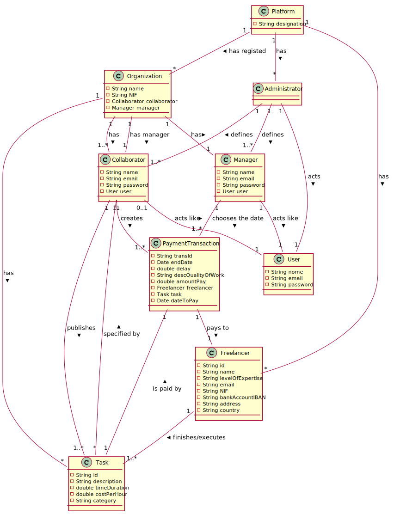

# OO Analysis #
The domain model construction process is based on use cases, in particular, the nouns used, and the description of the statement.
## Rational for identifying domain classes ##
For the identification of domain classes, the list of categories of TP classes (suggested in the book) is used. As a result, we have the following table of concepts (or classes, but not software) by category.

### _Category List_ ###

**Transactions**

* PaymentTransaction

---

**Transactions lines**

*

---

**Transaction-related products or services**

*  Task
* PaymentTransaction

---


**Regists (transactions)**

*

---  


**Roles**

* Administrator
* Freelancer
* Collaborator
* Manager
* User
---


**Places**

*  Platform

---

**Events**

* 

---


**
Physical objects**

*

---


**Specifications and descriptions**  

*  Task
* PaymentTransaction
---


**Catalogs**

*

---


**Sets**

* RegistFreelancer
* PaymentTransactionList
* RegistOrganization
* TaskList
---


**Elements sets**

*  

---


**Organizations**

*  T4J (Platform)
*  Organization

---

**Other External systems**

*  CoinCurrencieConvert
*  ExternAlgorithmPasswordGenerator


---


**Records (financial), work, contracts, legal documents**

* Files

---


**Financial tools**

* PaymentTransaction

---


**Referred documents / to perform the tasks /**

*

---



## **Rationale about identifying associations between classes** ##


| Concept (A) 		|  Association   		|  Concept (B) |
|----------	   		|:-------------:		|------:       |
| Administrator 	| define    		 	| Organizations  |
|   					| define            | Manager  |
|   					| define      | Collaborator  |
|						| acts as			| User |
|						| works for                           | Platform |
| Platform		| has    | Organizations  |
|						| has/uses 			| Freelancer  |
|						| has     			| Administrator |
|						| uses				| ExternAlgorithmPasswordGenerator	|
| Organization			| has  	   | Collaborator  |
|						| has     	| Manager |
|						| has		     	| Task |
|                                                                 | has                         | PaymentTransaction |
| Task		    	| specified by 	| Collaborator |
|                                           | is paid by                           | PaymnetTransaction |
| Freelancer			| executes			| Task |
|
| Collaborator			| acts as			| User |
| 						| creates			| Tasks |
|						| creates				| Freelancer	|
| ExternAlgorithmPasswordGenerator			| generates passwords for	| User	|	
|PaymnetTransaction                    | pays to                               | Freelancer |
|Manager                                      | chooses the date               | PaymentTransaction |
|                                                    | acts as                              | User |

## Modelo de Domínio






