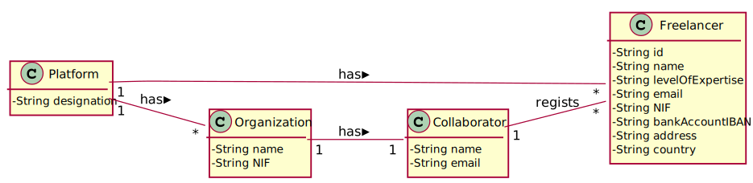
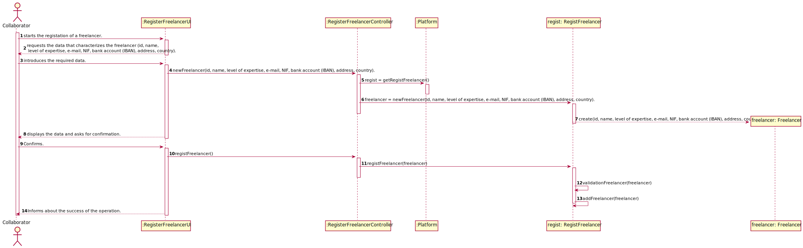

# UC 01 - Register Freelancer

## 1. Requirements engineering

### Brief Format

The collaborator starts registering a freelancer. The system requests the data that characterizes the freelancer (id, name, level of expertise, e-mail, NIF, bank account (IBAN), address and country). The collaborator enters the requested data. The system validates and displays the data, asking the collaborator to confirm it. The collaborator confirms. The system registers the freelancer's data and informs the manager of the success of the operation.

### SSD




### Full Format

#### Main actor

Collaborator

#### Stakeholders and their interests

**Collaborator:** want to register the freelancer to make payments transactions.

**T4J:** wants that payment transactions are made to freelancers.

#### Preconditions

none

#### Postconditions

* The Freelancer's regist information is saved in the system.

#### Main success scenario (or basic flow)

1. The collaborator starts registering a freelancer.
2. The system requests the data that characterizes the freelancer (id, name, level of expertise, e-mail, NIF, bank account (IBAN), address and country).
3. The collaborator enters the requested data.
4. The system validates and displays the data, asking the collaborator to confirm it. 
5. The collaborator confirms.
6. The system registers the freelancer's data and informs the collaborator of the success of the operation.

#### Extension (or alternative flow)

*a. The collaborator requires the cancelation of the regist.

> The use case ends.

4a. The data is incomplete.
>	1. The system informs about the missing data.
>	2. The system allows the collaborator to introduce the missing data (3rd step)
>
	>	2a. The collaborator doesn't change the data. The use case ends.
	
4b. The data is wrong.
>	1. The system informs about the wrong data.
>	2. The system allows the collaborator to introduce new data (3rd step)
>
	>	2a. The collaborator doesn't change the data. The use case ends.

10c. The system notices that some data is already in the system.
>	1. The system alerts the collaborator.
>	2. The system allows the collaborator to change the data introduced.
>
	>	2a. The collaborator doesn't change the data. The use case ends.


#### Special Requirements **A password deve ser gerada pela plataforma recorrendo a um algoritmo externo (i.e. concebido por terceiros)**

#### List of Technologies and Data Variations

\-

#### Frequency of Occurrence

\-

#### Open questions

* Are there any other mandatory data in addition to those already known?
* What data together can detect the duplication of freelancers?
* How often does this use case occur?

## 2. OO Analysis

### Excerpt from the Relevant Domain Model for UC




## 3. Design - Use Case Realization

### Rational

| Main Flow | Question: What Class... | Answer  | Justification |
|:--------------  |:---------------------- |:----------|:---------------------------- |
|1. The collaborator starts the registation of a freelancer |... interacts with the collaborator?| RegisterFreelancerUI |Pure Fabrication|
| |...coordinates the UC?| RegisterFreelancerController |Controller|
| |... create instances of Freelancer?|RegistFreelancer|Creator(regra1) combined with HC+LC on Plataform.|
|2. The system requests the data that characterizes the freelancer (id, name, level of expertise, e-mail, NIF, bank account (IBAN), address and country).||||
|3. The collaborator enters the required data. |... saves the data entered?|Freelancer| instance created in step 1.|
|4. The system validates and displays the data, asking the collaborator to confirm it. |... validates the freelancer's data? (local validation)|Freelancer| has its own data.|
| |... validates the freelancer's data? (global validation)|RegistFreelancer| RegistFreelancer has registered Freelancer.|
|5. The collaborator confirms.  ||||
|6. The system registers the freelancer's data and informs the manager of the success of the operation. |... saves the Freelancer created?| RegistFreelancer |In MD the Platform has Organization.|

### Systematization ##

It follows from the rational that the conceptual classes promoted to software classes are:

 * Platform
 * Freelancer

Other software classes (Pure Fabrication) identified:  

 * RegisterFreelancerUI  
 * RegisterFreelancerController
 * RegistFreelancer
 


###	Sequence Diagram




###	Class Diagram





