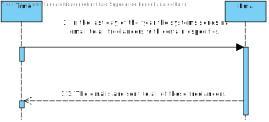

# UC10 - Send Email

## 1. Requirements engineering

### Brief Format

#### First Scenario

The payments will be made automatically by the system whenever we arrive to the time scheduled by the manager of the organization. The payment will be made by bank transfer to the freelancer account and the freelancer will also receive one e-mail with a receipt describing the amount to pay for each task and the overall payment value.

#### Second Scenario
In the last day of every year the system automatically send an e-mail to all the freelancers who have a mean task delay time (during the current year) that is higher than 3 hours and have a percentage of delays (during the current year) that is higherthan the overall percentage of delays.

### SSD

#### First scenario



#### Second scenario



### Complete format

#### Main actor

* Platform 

#### Interested groups and their interests
* ** Freelancer ** Receive one e-mail with a receipt describing the amount to pay for each task and the overall payment value. / Receibe one email if has a mean task delay time higher than 3 hours and a have a perdcentage of delays that is higherthan the overall percentage of delays.
* ** Organization ** Sending a receipt to the freelancer. / Warn the freelancers about the low productivity comparing to all freelancers in the system.
* ** T4J Admin ** Give the availability of this function. / Give the hability to freelancers receive an email about theirs stats that are less productive than the rest of the freelancers.

#### Preconditions
* Existing a file to save the information. / Existing methods that calculates the statistics.

#### Postconditions
* Saving the information in the file. / The email is sent successfully to the freelancer(saving the information in the file).

### Main success scenario (or basic flow)

### First scenario
1. The time arrives scheduled by the manager. 
2. The email containing the information is saved with sucess in the file.

#### Extensions (or alternatives flows)

2a. The system doesn´t find the file, so it can´t save the information.
>	1. The use creates a warning 
>
	>	1.a The use case ends.

### Second scenario

1. The last day arrives and the system sends an email to all of freelancers.
2. The email containing the information is saved with sucess in the file.

#### Extensions (or alternatives flows)

2a. The system doesn´t find the file, so it can´t save the information.
>	1. The use creates a warning 
	>	1.a The use case ends.

#### Special requirements
\-

#### List of Technology Variations and Data
\-

#### Frequency of Occurrence
\- Everytime there is and transaction made to the freelancer.

#### Open questions

* What type of warning should be done if something goes wrong?
* Where should i save the emails of the stats (the same file of the first scenario)? 
 
## 2. Analise OO

###  Excerpt from the Domain Model relevant for the UC

#### First Scenario



#### Second Scenario



## 3. Design - Use Case Realization

### Racional

#### First Scenario

| Main flow | Question: Which Class... | Answer  | Justification |
|:--------------  |:---------------------- |:----------|:---------------------------- |
| 1. The time arrives scheduled by the manager. | Manages the action | Platform | It has the time scheduled by the manager and has the access to the other classes. |
| 2. The email containing the information is saved with sucess in the file. | Has the file and info | Email | This class has gona save this info in a file. |

#### Second Scenario

| Main flow | Question: Which Class... | Answer  | Justification |
|:--------------  |:---------------------- |:----------|:---------------------------- |
| 1. The last day arrives and the system sends an email to all of freelancers. | Knows the time? | Date and Platform | Time checks the actual time and the platform will know form the class Time |
| 2. The email containing the information is saved with sucess in the file. | Has the file and info | Email | This class has gona save this info in a file. |

### Systematization ##

From the racional results on the conceptual classes  promoted to software classes are:

* Platform
* Email
* Date

Other software classes (i.e. Pure Fabrication) identified: 
 
 * 

###	Diagrama de Sequência

#### First scenario



#### Second scenario



###	Diagrama de Classes

#### First scenario



#### Second scenario











































