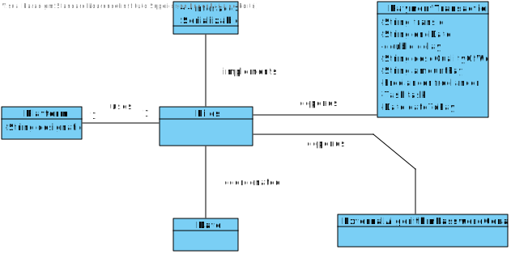
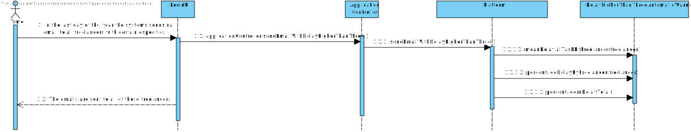

# UC10 - Receive file with transaction history

## 1. Requirements engineering

### Brief Format

#### First Scenario

The payments will be made automatically by the system whenever we arrive to the time scheduled by the manager of the organization. The payment will be made by bank transfer to the freelancer account and the freelancer will also receive one e-mail with a receipt describing the amount to pay for each task and the overall payment value.

#### Second Scenario

### SSD

#### First scenario



#### Second scenario



### Complete format

#### Main actor

* Platform 

#### Interested groups and their interests
* ** Freelancer ** Receive one e-mail with a receipt describing the amount to pay for each task and the overall payment value. /
* ** Organization ** Sending a receipt to the freelancer. /
* ** T4J Admin ** Give the availability of this function. /

#### Preconditions
* Existing a file to save the information. /

#### Postconditions
* Saving the information in the file. /

### Main success scenario (or basic flow)

### First scenario
1. The time arrives scheduled by the manager. 
2. The email containing the information is saved with sucess in the file

#### Extensions (or alternatives flows)

2a. The system doesn´t find the file, so it can´t save the information.
>	1. The use creates a warning 
>
	>	1.a The use case ends.

### Second scenario

1.
2.

#### Extensions (or alternatives flows)

2a.
>	1.

#### Special requirements
\-

#### List of Technology Variations and Data
\-

#### Frequency of Occurrence
\- Everytime there is and transaction made to the freelancer.
\-

#### Open questions

* What type of warning should be done if something goes wrong? 
 

## 2. Analise OO

###  Excerpt from the Domain Model relevant for the UC

#### First Scenario



#### Second Scenario



## 3. Design - Use Case Realization

### Racional

| Main flow | Question: Which Class... | Answer  | Justification |
|:--------------  |:---------------------- |:----------|:---------------------------- |
| 1. The time arrives scheduled by the manager. | Manages the action | Platform | It has the time scheduled by the manager and has the access to the other classes. |
| 2. The email containing the information is saved with sucess in the file. | Has the file and info | Email | This class has gona save this info in a file. |

### Systematization ##

From the racional results on the conceptual classes  promoted to software classes are:

* Platform
* Email

Other software classes (i.e. Pure Fabrication) identified: 
 
 * 

###	Diagrama de Sequência

#### First scenario



#### Second scenario



###	Diagrama de Classes

#### First scenario



#### Second scenario








































