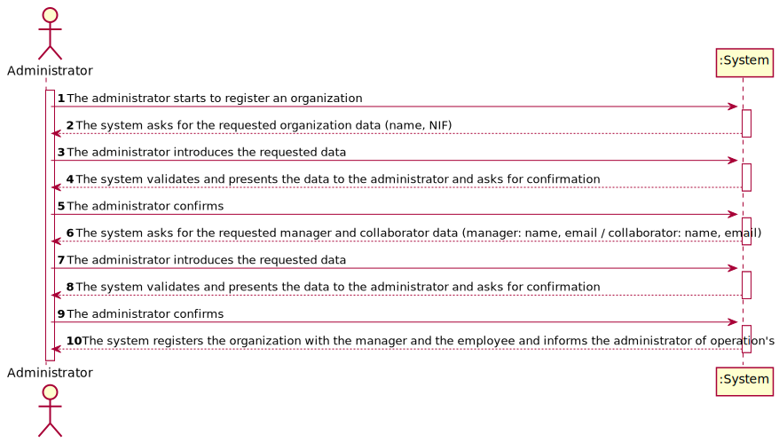
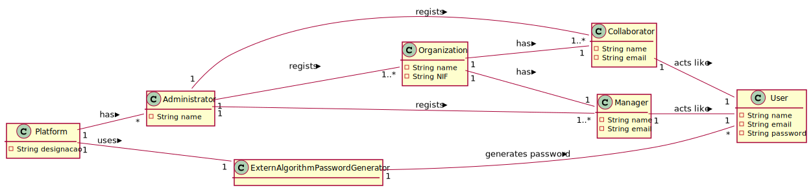

# UC2 - Register Organization

## 1. Requirements engineering

### Brief Format

The administrator starts to register an organization. The system asks for the requested organization data (name). The administrator introduces the requested data. The system **validates** and presents the data to the administrator and asks for confirmation. The administrator confirms. The system asks for the requested manager and collaborator data (manager: name, email / collaborator: name, email). The administrator introduces the requested data. The system **validates** and presents the data to the administrator and asks for confirmation. The administrator confirms.  The system registers the organization with the manager and the employee and informs the administrator of operation's success.

### SSD



### Full format

#### Main actor

* Administrator

#### Stakeholders and their interests
* **Administrator:** wants to register an organization and it's manager and collaborator.
* **Organização:** wants to have one manager and one collaborator.
* **T4J:** wants to have organizations registered.


#### Preconditions
* n/a

#### Postconditions
* The organization's information is stored in the system
* The manager and collaborator informations are stored in the system
* A user is created on the platform for the Manager.
* A user is created on the platform for the Collaborator.

### Main success scenario (or basic flow)

1. The administrator starts to register an organization.
2. The system asks for the requested organization data (name).
3. The administrator introduces the requested data.
4. The system **validates** and presents the data to the administrator and asks for confirmation.
5. The administrator confirms.
6. The system asks for the requested manager and collaborator data (manager: name, email / collaborator: name, email).
7. The administrator introduces the requested data.
8. The system **validates** and presents the data to the administrator and asks for confirmation.
9. The administrator confirms.
10. The system registers the organization with the manager and the collaborator as an user and send automatically the password by email and informs the administrator of operation's success.

#### Extensions (or alternative flows)

*a. The administrator requests to stop the register.

> The use case ends.

4a or 8a. Missing minimum required data.
>	1. The system informs which data is missing.
>	2. The system allows the entry of missing data (3rd step).
>
	>	2a. The administrator does not change the data. The use case ends.

4b or 8b. The system detects that the data (or some subset of the data) entered must be unique and that it already exists in the system.
>	1. The system alerts the administrator to the fact.
>	2. The system allows its modification (3rd step or 7th step).
>
	>	2a. The administrator does not change the data. The use case ends.

4c or 8c. The system detects that the entered data (or some subset of the data) is invalid.
> 	1. The system alerts the administrator to the fact.
> 	2. The system allows its modification (3rd step or 7th step).
>
	> 2a. The administrator does not change the data. The use case ends.

#### Special requirements
\-

#### List of Technologies Variations and Data 
\-

#### Frequency of Occurrence
\-

#### Open questions

* Are there other data that are needed?
* Is all data required?
* What data uniquely identifies an organization manager and collaborator ?
* Are the manager and collaborator passwords automatically generated by the system? Or should it be introduced by the administrator?
* What are the security rules applicable to the password?
* What is the password notification process?

## 2. OO Analysis

### Piece of the global modal relevant for the use case




## 3. Design - Execution of the use case

### Racional

| Main flow | Question: What class... | Answer  | Justification  |
|:--------------  |:---------------------- |:----------|:---------------------------- |
| 1. O gestor de organização inicia a especificação de um colaborador da sua organização.   		 |	... interage com o utilizador? | EspecificarColaboradorUI    |  Pure Fabrication: não se justifica atribuir esta responsabilidade a nenhuma classe existente no Modelo de Domínio. |
|  		 |	... coordena o UC?	| EspecificarColaboradorController | Controller    |
|  		 |	... cria instância de Colaborador?| RegistoColaboradores   | Creator (Regra1)|
||...conhece o utilizador/gestor a usar o sistema?|SessaoUtilizador|IE: cf. documentação do componente de gestão de utilizadores.|
||...sabe a que organização o utilizador/gestor pertence?|Plataforma|IE: conhece todas as organizações.|
|||Organização|IE: conhece o seu gestor/colaborador.|
|||Colaborador|IE: conhece os seus dados (e.g. email). |
| 2. O sistema solicita os dados necessários (i.e. nome, função, contacto telefónico, endereço de email).  		 |							 |             |                              |
| 3. O gestor de organização introduz os dados solicitados.  		 |	... guarda os dados introduzidos?  |   Colaborador | Information Expert (IE) - instância criada no passo 1: possui os seus próprios dados.     |
| 4. O sistema valida e apresenta os dados ao gestor de organização, pedindo que os confirme.   		 |	... valida os dados do Colaborador (validação local) | Colaborador |      IE: possui os seus próprios dados.|  	
|	 |	... valida os dados do Colaborador (validação global) | RegistoColaboradores  | IE: o RegistoColaboradores contém/agrega Colaborador.  |
| 5. O gestor de organização confirma os dados.   		 |							 |             |                              |
| 6. O sistema regista os dados do colaborador, gera a sua password, torna-o um utilizador registado e informa o gestor de organização do sucesso da operação.  		 |	... guarda o Colaborador criado? | RegistoColaboradores  | IE: o RegistoColaboradores contém/agrega Colaborador.|  
||... gera a password?|AlgoritmoGeradorPasswords|IE: é a Interface que está a gerir as passwrods.|
|	| ... regista/guarda o Utilizador referente ao Colaborador? | AutorizacaoFacade  | IE: a gestão de utilizadores é responsabilidade do componente externo respetivo, cujo ponto de interação é através da classe "AutorizacaoFacade".|


### Sistematização ##

 Do racional resulta que as classes conceptuais promovidas a classes de software são:

* Organização
* RegistoColaboradores
* Colaborador
* Plataforma


Outras classes de software (i.e. Pure Fabrication) identificadas:  

 * EspecificarColaboradorUI  
 * EspecificarColaboradorController

Outras classes de sistemas/componentes externos:

 * SessaoUtilizador
 * AutorizacaoFacade


###	Diagrama de Sequência



#### UC5_SD_RegistaUtilizadorComPapel



#### UC5_SD_getOrganizacaoByEmailUtilizador


###	Diagrama de Classes











