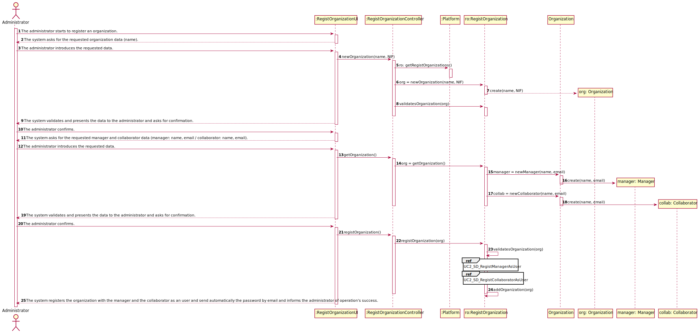
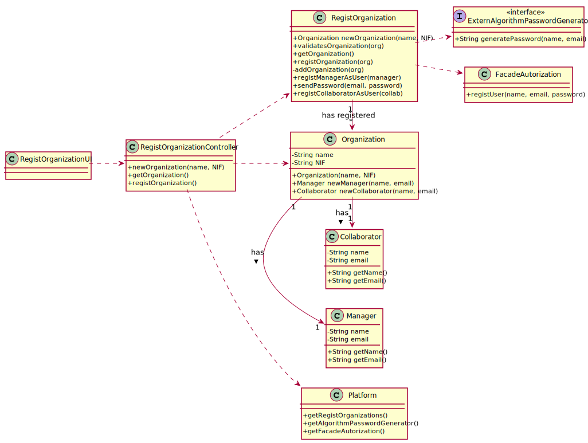

# UC2 - Register Organization

## 1. Requirements engineering

### Brief Format

The administrator starts to register an organization. The system asks for the requested organization data (name). The administrator introduces the requested data. The system **validates** and presents the data to the administrator and asks for confirmation. The administrator confirms. The system asks for the requested manager and collaborator data (manager: name, email / collaborator: name, email). The administrator introduces the requested data. The system **validates** and presents the data to the administrator and asks for confirmation. The administrator confirms.  The system registers the organization with the manager and the employee and informs the administrator of operation's success.

### SSD



### Full format

#### Main actor

* Administrator

#### Stakeholders and their interests
* **Administrator:** wants to register an organization and it's manager and collaborator.
* **Organização:** wants to have one manager and one collaborator.
* **T4J:** wants to have organizations registered.


#### Preconditions
* n/a

#### Postconditions
* The organization's information is stored in the system
* The manager and collaborator informations are stored in the system
* A user is created on the platform for the Manager.
* A user is created on the platform for the Collaborator.

### Main success scenario (or basic flow)

1. The administrator starts to register an organization.
2. The system asks for the requested organization data (name).
3. The administrator introduces the requested data.
4. The system **validates** and presents the data to the administrator and asks for confirmation.
5. The administrator confirms.
6. The system asks for the requested manager and collaborator data (manager: name, email / collaborator: name, email).
7. The administrator introduces the requested data.
8. The system **validates** and presents the data to the administrator and asks for confirmation.
9. The administrator confirms.
10. The system registers the organization with the manager and the collaborator as an user and send automatically the password by email and informs the administrator of operation's success.

#### Extensions (or alternative flows)

*a. The administrator requests to stop the register.

> The use case ends.

4a or 8a. Missing minimum required data.
>	1. The system informs which data is missing.
>	2. The system allows the entry of missing data (3rd step).
>
	>	2a. The administrator does not change the data. The use case ends.

4b or 8b. The system detects that the data (or some subset of the data) entered must be unique and that it already exists in the system.
>	1. The system alerts the administrator to the fact.
>	2. The system allows its modification (3rd step or 7th step).
>
	>	2a. The administrator does not change the data. The use case ends.

4c or 8c. The system detects that the entered data (or some subset of the data) is invalid.
> 	1. The system alerts the administrator to the fact.
> 	2. The system allows its modification (3rd step or 7th step).
>
	> 2a. The administrator does not change the data. The use case ends.

#### Special requirements
\-

#### List of Technologies Variations and Data 
\-

#### Frequency of Occurrence
\-

#### Open questions

* Are there other data that are needed?
* Is all data required?
* What data uniquely identifies an organization manager and collaborator ?
* Are the manager and collaborator passwords automatically generated by the system? Or should it be introduced by the administrator?
* What are the security rules applicable to the password?
* What is the password notification process?

## 2. OO Analysis

### Piece of the global modal relevant for the use case




## 3. Design - Execution of the use case

### Racional

| Main flow | Question: What class... | Answer  | Justification  |
|:--------------  |:---------------------- |:----------|:---------------------------- |
| 1. The administrator starts to register an organization. |	... interact with the user? | RegistOrganizationUI    |  Pure Fabrication: it is not justified to assign this responsibility to any existing class in the Domain Model. |
|  		 |... coordinates the UC?| RegistOrganizationController | Controller    |
|  		 |... creates instance of Organization?| RegistOrganization   | By the application of the Creator (R1) it would be the "Platform". But, by applying HC + LC to the "Platform", this delegates that responsibility to the "RegistOrganization".|
|		 |… do know the user / administrator using the system?|UserSession|IE: according to the user management component documentation.|
| 2. The system asks for the requested organization data (name).||||
| 3. The administrator introduces the requested data. |	... save the data entered?  | Organization | Information Expert (IE) - instance created in step 1: it has its own data.     |
| 4. The system **validates** and presents the data to the administrator and asks for confirmation. |	… validates the Organization's data (local validation)?| Organization | IE: has its own data.|  	
| 5. The administrator confirms.  ||||
| 6. The system asks for the requested manager and collaborator data (manager: name, email / collaborator: name, email). ||||
| 7. The administrator introduces the requested data. | ... save the data entered? | Manager, Collaborator | Information Expert (IE) : it has its own data. |
| 		|... creates instance of Manager?| Organization |  creator(rule1) |
|		|... creates instance of Collaborator?| Organization | creator(rule1) |
| 8. The system **validates** and presents the data to the administrator and asks for confirmation. |... validates the Manager's data (local validation)?| Manager | IE: it has its own data. |
| 		|... validates the Collaborator's data (local validation)?| Collaborator | IE: it has its own data. |
|		|... validates the Organization's data (global validation)?| RegistOrganization | IE: The RegistOrganization has registered Organization |
| 9. The administrator confirms. ||||
| 10. The system registers the organization with the manager and the collaborator as an user and send automatically the password by email and informs the administrator of operation's success.| … saves the Organization created? | RegistOrganization | IE: By applying HC + LC to the Platform |
|		|… generates the passwords? | ExternAlgorithmPasswordGenerator | Protected Variation
|		|... register / keep the User regarding the Organization's Collaborator and Organization's Manager?| FacadeAutorization | IE. User management is the responsibility of the respective external component whose point of interaction is through the class "FacadeAutorization" |
|		|... sends the manager's and collaborator's email? | RegistOrganization | IE: has necessary information |

### Systematization ##

It follows from the rational that the conceptual classes promoted to software classes are:

* Platform
* Organization
* Manager
* Collaborator
* ExternAlgorithmPasswordGenerator

Other software classes (Pure Fabrication) identified:

 * RegistOrganizationUI
 * RegistOrganizationController

Other classes of external systems / components:

 * UserSession
 * FacadeAutorization


###	Sequence Diagram



#### UC2_SD_RegistManagerAsUser



#### UC2_SD_RegistCollaboratorAsUser



###	Class Diagram


















