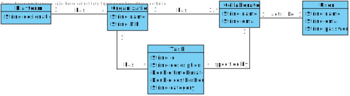
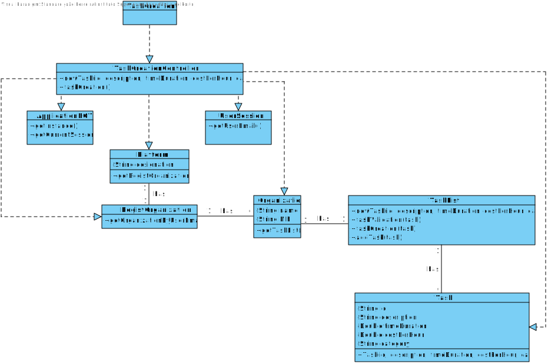

# UC3 - Task Creation

## 1. Requirements engineering

### Brief Format

The organization collaborator starts task creation. The system asks for the necessary data (E.g. id, brief description, time duration (in hours), cost per hour (in euros), and task category). The organization collaborator enters the requested data. The system validates and presents the data to the organization collaborator, asking him to confirm it. The organization collaborator confirms. The system records the data and informs the organization collaborator to the success of the operation.

### SSD



### Full Format

#### Main Actor

*  Collaborator of the Organization 

#### Stakeholders and their interests

* **Organization Collaborator:** want to specify the organization’s collaborator.
* **Organization:** wants its collaborators to be registered so that they can act on their behalf.
* **T4J:** intends that organizations can register their collaborators.

#### Preconditions
* n/a

#### Postconditions
* The information of the new organization collaborator is recorded in the system.
* The Collaborator also becomes a registered user of the system.

### Main success scenario (or basic flow)

1. The organization collaborator starts task creation.
2. The system asks for the necessary data (E.g. id, brief description, time duration (in hours), cost per hour (in euros), and task category).
3. The organization collaborator enters the requested data.
4. The system validates and presents the data to the organization collaborator, asking him to confirm it.
5. The organization collaborator confirms.
6. The system records the data and informs the organization collaborator to the success of the operation.


#### Extensions (or alternative flows)

*a. The organization collaborator requests to cancel the job specification.

> The use case ends.

4a. Missing minimum required data.
>	1. The system informs you which data is missing.
>	2. The system allows the entry of missing data (step 3)
>
	>	2a. The organization collaborator does not change the data. The use case ends.

4b. The system detects that the data (or some subset of the data) entered must be unique and that it already exists in the system.
>	1. The system alerts the organization collaborator to the fact.
>	2. The system allows you to change it (step 3)
>
	>	2a. The organization collaborator does not change the data. The use case ends.

4c. The system detects that the data entered (or some subset of the data) is invalid.
> 1. The system alerts the organization manager to the fact.
> 2. The system allows you to change it (step 3).
>
	> 2a. The organization manager does not change the data. The use case ends.

#### Special requirements

* The estimated duration of a task is indicated in hours.
* The estimated cost is shown in euros.

#### List of Technologies and Data Variations
\-

#### Frequency of Occurrence
\-

#### Open questions

* There are other data that are needed?
* All data is required?
* How often does this use case occur?

## 2. OO Analysis

### Excerpt from the Relevant Domain Model for UC



## 3. Design - Use Case Realization

### Rational

| Fluxo Principal | Questão: Que Classe... | Resposta  | Justificação  |
|:--------------  |:---------------------- |:----------|:---------------------------- |
| 1. The organization collaborator starts task creation.  |  ...interacts with the user? | TaskCreationUI   | Pure Fabrication: there is no reason to assign this responsibility to any existing class in the Domain Model. |
|  		 |	... coordinates the UC?	| TaskCreationController | Controller    |
|  		 |	... creates Task instance? | TaskList | Creator (Rule 1): in the MD the Organization has a Task.   |
||...knows the user / manager using the system? | UserSession | IE: cf. user management component documentation.|
||...know which organization the user / collaborator belongs to? | Platform | IE: knows all organizations.|
|||Organization |IE: know your collaborators.|
|||Collaborator | IE: know your data (e.g. email). |
| 2. The system asks for the necessary data (E.g. id, brief description, time duration (in hours), cost per hour (in euros), and task category)). 		 |							 |             |                              |
| 3. The organization collaborator enters the requested data.  		 |	...saves the entered data?  |   Task | Information Expert (IE) -instance created in step 1: has its own data.     |                   |
| 4. The system validates and presents the data to the organization collaborator, asking him to confirm it.   		 |	... 
validates the Task data (local validation)? | Task |            IE: has its own data.|  	
|	 |	... validates Task data (global validation)? | TaskList  | IE: the Organization contains / aggregates Task.  |
| 5. The organization collaborator confirms.   		 |							 |             |                              |
| 6. The system records the data and informs the organization collaborator to the success of the operation.  		 |	... saves the created Task? | Organization  | IE: the Organization contains / aggregates Task. |

### Systematization ##

It follows from the rational that the conceptual classes promoted to software classes are:

* Organization
* Task
* Platform


Other software classes identified:  

 * TaskCreationUI  
 * TaskCreationController

Other classes of external systems / components:

 * UserSession


###	Sequence Diagram



#### UC3_getOrganizacaoByEmailUtilizador_SD


###	Class Diagram
















