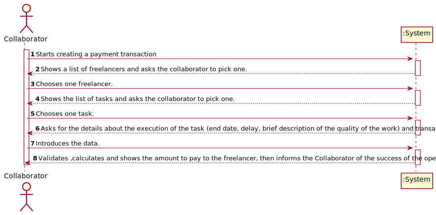
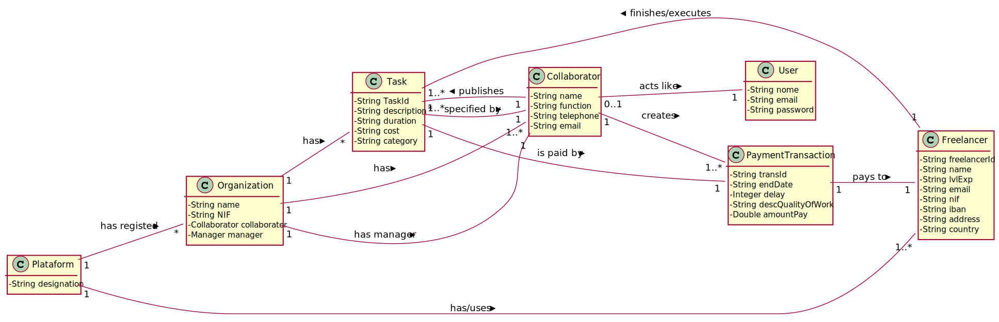
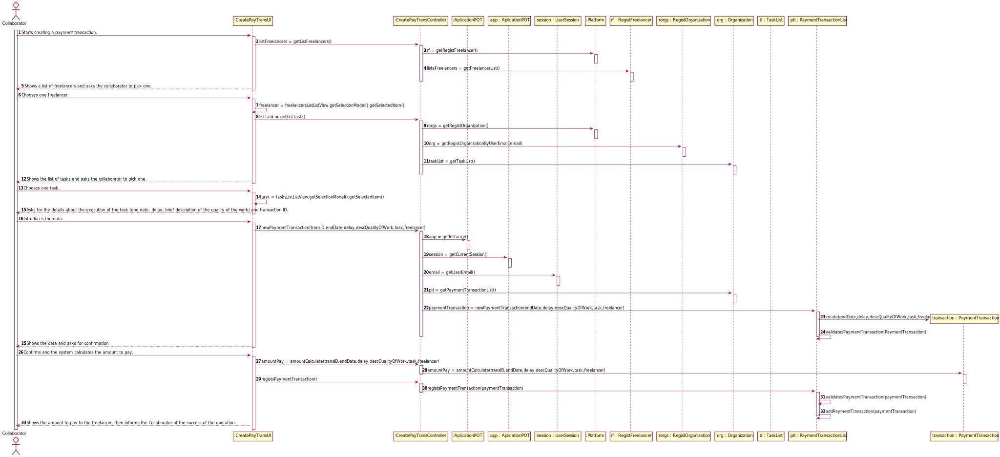


# UC4 - Create payment transaction

## 1. Requirements Engineering

### Brief format

The collaborator starts creating a payment transaction. The system shows a list of freelancers and asks the collaborator to pick one. The collaborator chooses one freelancer. The system shows the list of tasks. The Collaborator chooses one task. The system asks for the details about the execution of the task (end date, delay, brief description of the quality of the work) and the ID of the transaction. The Collaborator introduces the data. The system validates, calculates and shows the amount to pay to the freelancer, then informs the Collaborator of the success of the operation.

### SSD


### Full format 

#### Main actor

* Collaborator

#### Stakeholders and their interests

* **Collaborator:** pretends to create a payment transaction;
* **Freelance:**: pretends to be paid by the organization for his tasks.
* **T4J:** pretends that his freelancers get paid by the organization that they made the tasks for.

#### Preconditions
* There needs to be done a task, by a freelancer, to be paid for.

#### Postconditions
* All the payments made by the organizations will be registered in a file.

#### Main success scenario (or basic flow)

1. The collaborator pretends to create a payment transaction.
2. The system shows a list of freelancers and asks the collaborator to pick one.
3. The collaborator chooses one freelancer.
4. The system shows the list of tasks and asks the Collaborator to pick one.
5. The Collaborator chooses one task. 
6. The system asks for the details about the execution of the task (end date, delay, brief description of the quality of the work) and the transaction ID.
7. The Collaborator introduces the data.
8. The system validates ,calculates and shows the amount to pay to the freelancer, then informs the Collaborator of the success of the operation.

#### Extensions (or alternative flow)

*a. The collaborator asks to end the process.

> The use case ends.

*2a. The information describing the task and the freelancer is not available.

> The system allows the collaborator to create a task and a freelancer in the system.

8a. Missing minimum required data.
>	1. The system warns about the missing data.
>	2. The system allows the introduction of the missing data. (step 2)
>
	>	2a. The collaborator doens't change the data. The use case ends.

#### Special requirements
* The time duration needs to be in hours.
* The cost per hour needs to be in euros.

#### List of Technologies Variations and Data
\-

#### Frequency of Occurrence
\-

#### Open questions

## 2.  OO Analyzes

### Piece of the global modal relevant for the use case



## 3. Design - Execution of the use case

### Racional

| Main flow | Question: What Class... | Answer  | Justification  |
|:--------------  |:---------------------- |:----------|:---------------------------- |
| 1. The collaborator starts creating a payment transaction.  |	... interacts with the user? | CreatePaymentTransactionUI |  Pure Fabrication. |
|  		 |	... coordinates the UC?	| CreatePaymentTransactionController | Controller    |
|  		 |	... creates instance of PaymentTransaction? |  CreatePayTrans | By applying HC + LC to the "Platform", this delegates that responsibility to the "CreatePayTrans".   |
||… knows the user / collaborator using the system?|UserSession|IE: according to the user management component documentation.|
||...knows which organization does the collaborator belongs too?| Platform |IE: knows all organizations. |
|||Organization|IE: knows his collaborators.|
|||Collaborator|IE: knows his data. |
| 2. The system shows a list of freelancers and asks the collaborator to pick one. | ...knows the list of Freelancers?	 |  RegistFreelancer | IE : RegistFreelancer has all instances of Freelancer. |
| 3. The collaborator chooses one freelancer. | ...saves the chosen freelancer? |PayementTransaction| IE : Has is own data|
| 4. The system shows the list of tasks and asks the Collaborator to pick one.|...knows the list of tasks?| TaslList | IE: TaskList has all instances of Tasks. |
| 5.  The Collaborator chooses one task. | ...saves the chosen task? | PayementTransaction | IE: Has is own data.|
| 6. The system asks for the details about the execution of the task (end date, delay, brief description of the quality of the work) and transaction ID. ||||
| 7. The Collaborator introduces the data. | ...saves the introduced data? | PaymentTransaction | IE : Has is own data. |
| 8. The system validates, calculates and shows the amount to pay to the freelancer, then informs the Collaborator of the success of the operation. | ...calculates the amount to pay? | PaymentTransaction | Has a metod that calculates the amount to pay. |
|| ..saves the created Payment Transaction? | TransactionsList | IE: TransactionsList contains PaymentTransaction. |
|| ...validates the data of PaymenteTransaction? (local validation)| PaymentTransaction| IE: has is own data |
||...validates the data of PayementTransaction? (global validation) | TransactionsList | IE : TransactionsList contains PaymentTransaction. |

### Systematization ##

It follows from the rational that the conceptual classes promoted to software classes are:

 * Organizacion
 * Platform
 * Task
 * PaymentTransaction
 * RegistFreelancer

Other software classes (i.e. Pure Fabrication) identified:  

 * CreatePaymentTransactionUI
 * CreatePaymentTransactionController

Other classes of external systems / components:

 * UserSession

###	Diagrama de Sequência



###	Diagrama de Classes













