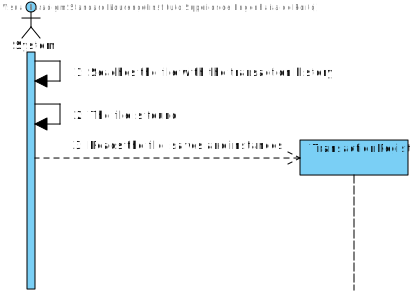
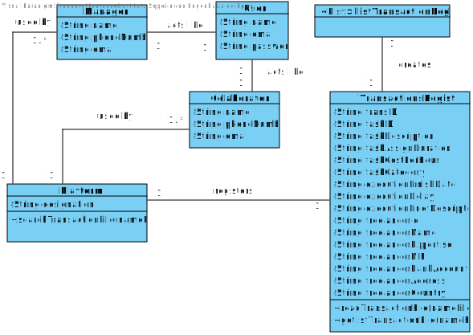

# UC5 - Receive file with transaction history

## 1. Requirements engineering

### Brief Format

The program starts to run. The systems searches the file with the transaction history and saves and instances.

#### Other way:

The user starts the program. Selects the file that wants to import and the systems searches the file with the transaction history and saves and instances.

### SSD

## Main scenario

## Second scenario

### Complete format

#### Main actor

* System (Main Scenario)
* User (Second scenario)

#### Partes interessadas e seus interesses
* ** T4J Admin ** Wants that users have the hability to import files.
* ** User ** Wants to import a file of his preference. 

#### Preconditions
* Existing file with the right conditions. 

#### Postconditions
* The system saves and instances the information.

### Main success scenario (or basic flow)

1. System searchs the file. 
2. The file is found.
3. The system reads the file and saves and instances 

### Secondary sucess scenario

1. User selects a file that he wants to use.
2. The file is found.
3. The system reads the file and saves and instances.

#### Extensions (or alternatives flows)

2a. The file is not found
>	1. The system shows the error
>
	>	1.a The use case ends.	
	>	1.b (In the secondary sucess scenario) The systems allows a introduction of a new file.
	>
		>	1.b.a The user doesnt wants to import other file. The use case ends.

#### Special requirements
\-

#### List of Technology Variations and Data
\-

#### Frequency of Occurrence
\- Every time the user wants to import a file.
\- Every time that the systems runs.

#### Open questions

* At the same run of the program you can import multiple files or one file at the run time?

## 2. Analise OO

###  Excerpt from the Domain Model relevant for the UC

#### Main Scenario

#### Second Scenario

## 3. Design - Use Case Realization

### Racional

| Main flow | Question: Which Class... | Answer  | Justification |
|:--------------  |:---------------------- |:----------|:---------------------------- |
|1. System searchs the file. / User selects a file that he wants to use. | Who is the user?... | Colaborator | Only the Manager and Colaborator of the Organization have these function | 
| 2. The file is found. | | | |
| 3. The system reads the file and saves and instances. | Who registers the data?... | TransactionRegister | It´s the class that will receive and save all the information. |

### Systematization ##

From the racional results on the conceptual classes  promoted to software classes are:

* Platform
* User
* Colaborator

Other software classes (i.e. Pure Fabrication) identified:  

 * TransactionRegister 

###	Diagrama de Sequência

#### Main scenario

#### Secondary scenario

###	Diagrama de Classes

