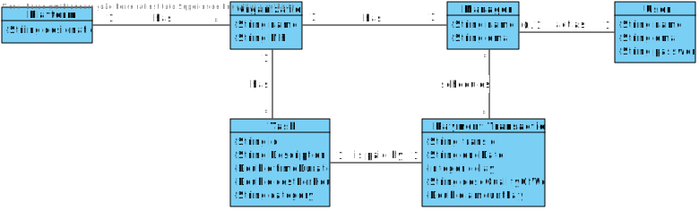
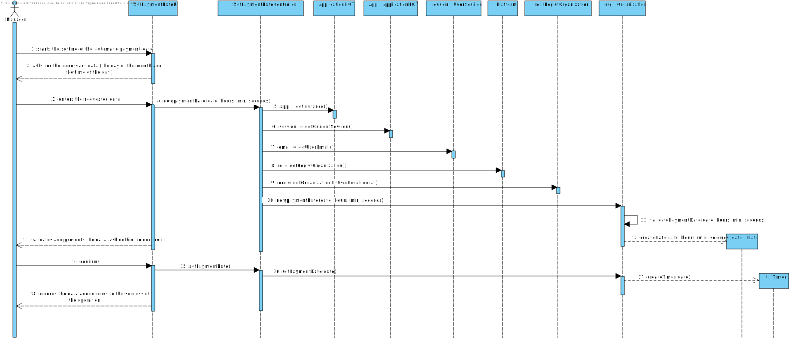

# UC6 - Set automatic payment date

## 1. Requirements engineering

### Brief Format

The manager of the organization starts the setting of the automatic payment date. The system asks for the necessary data (the day of the month and the time of the day). The manager of the organization  enters the requested data. The system validates and presents the data to the manager of the organization, asking him to confirm it. The manager of the organization confirms. The system records the data and informs the manager of the organization to the success of the operation.

### SSD



### Full Format

#### Main actor

*   Manager of the Organization

#### Stakeholders and their interests

* **The Manager of the Organization:** want to set the automatic payment date.
* **Organization:** want their task's with a payment date defined.
* **T4J:** intends that organizations can pay to their freelancers.

#### Preconditions

* Existing tasks previously created in the system.

#### Postconditions

* Saving the automatic payment date for the taks in the system.

###  Main success scenario (or basic flow)

1.  The manager of the organization starts the setting of the automatic payment date.
2.  The system asks for the necessary data (the day of the month and the time of the day).
3.  The manager of the organization  enters the requested data.
4.  The system validates and presents the data to the manager of the organization, asking him to confirm it.
5.  The manager of the organization confirms. 
6.  The system records the data and informs the manager of the organization to the success of the operation.

#### Extensions (or alternative flows)

*a. The manager of the organization requests to cancel the job specification.

> The use case ends.

4a. Missing minimum required data.
>	1. The system informs you which data is missing.
>	2. The system allows the entry of missing data (step 3)
>
	>	2a. The manager of the organization does not change the data. The use case ends.

4b. The system detects that the data (or some subset of the data) entered must be unique and that it already exists in the system.
>	1. The system alerts the manager of the organization to the fact.
>	2. The system allows you to change it (step 3)
>
	>	2a. The manager of the organization does not change the data. The use case ends.

4c. The system detects that the data entered (or some subset of the data) is invalid.
> 1. The system alerts the manager of the organization to the fact.
> 2. The system allows you to change it (step 3).
>
	> 2a. The manager of the organization does not change the data. The use case ends.


#### Special requirements
\-

#### List of Technologies varations and Data
\-

#### Frequency of occurrence
\- 

#### Open questions

* There are other data that are needed?
* All data is required?
* How often does this use case occur?

## 2. Analyze OO

### Excerpt from the Model with a relevant domain name for the UC




## 3. Design - Realization of the Use case

### Racional

| Main flow | Question: Which Class... | Anwser  | Justification |
|:--------------  |:--------------------- |:----------|:---------------------------- |
| 1.The manager of the organization starts the setting of the automatic payment date.  |  ...interacts with the user? | SetAutomaticPaymentDateUI   | Pure Fabrication: there is no reason to assign this responsibility to any existing class in the Domain Model. |
|  		 |	... coordinates the UC?	| SetAutomaticPaymentDateController | Controller    |
||...knows the user / manager using the system? | UserSession | IE: cf. user management component documentation.|
||...know which organization the user / manager belongs to? | Platform | IE: knows all organizations.|
|||Organization |IE: know your manager.|
|||Manager | IE: know your data (e.g. email). |
| 2. The system asks for the necessary data (the day of the month and the time of the day).  |				 |             |                     |
| 3. The manager of the organization  enters the requested data.  		 |	...saves the entered data?  |   Date | Information Expert (IE) -instance created in step 1: has its own data.     |                   |
| 4. The system validates and presents the data to the manager of the organization, asking him to confirm it.    |	...validates the Date data (local validation)? | Date |            IE: has its own data.|  	
|	 |	... validates Date data (global validation)? | PaymentTransaction  | IE: the PaymentTransaction contains / aggregates Date.  |
| 5. The manager of the organization confirms.   		 |							 |             |                              |
| 6. The system records the data and informs the manager of the organization to the success of the operation.  		 |	... saves the created Date? | PaymentTransaction  | IE: the PaymentTransaction contains / aggregates Date. |

### Systematization ##
From the racional results conceptual promoted to software classes that are:

* Organization
* Task
* Platform
* PaymentTransaction

Other software classes (i.e. Pure Fabrication) identificadas:  

 * SetAutomaticPaymentDateUI   
 * SetAutomaticPaymentDateController

Other classes of systems/external components :

 * UserSession

### Sequence Diagram



###	Class Diagram
















