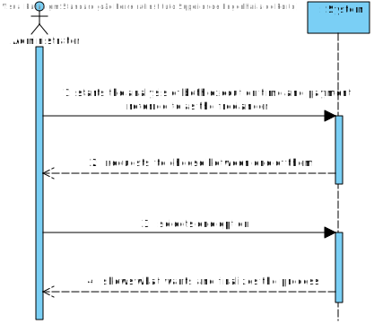
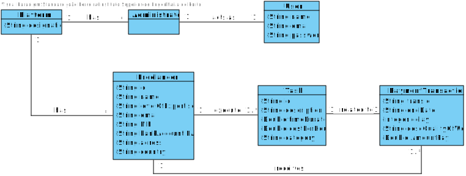
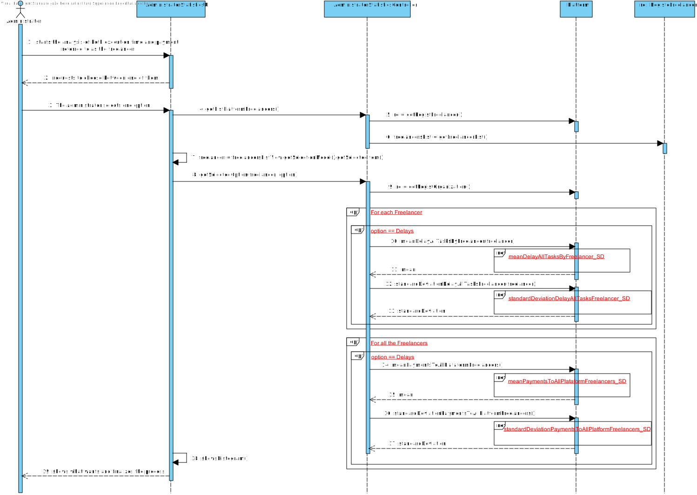
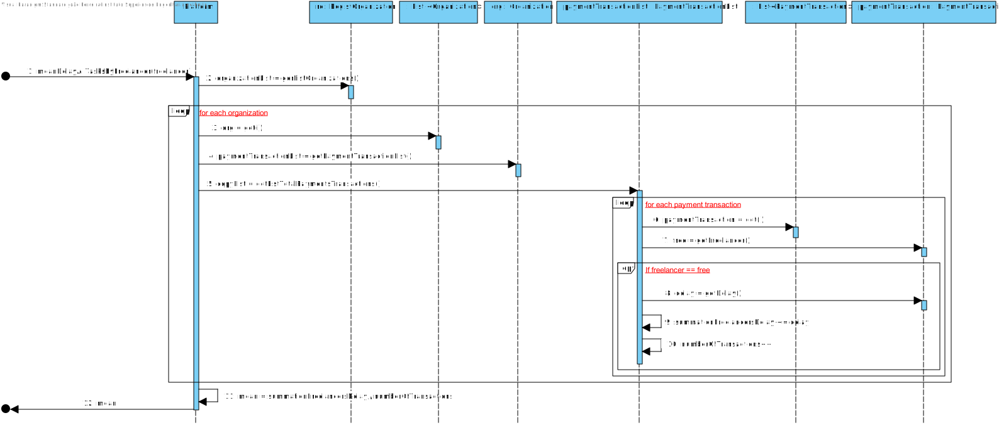
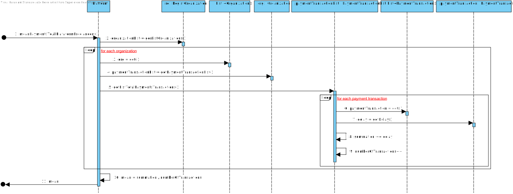
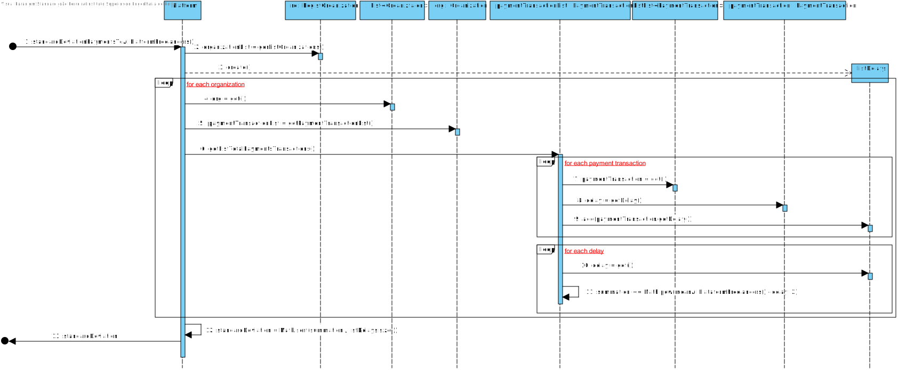
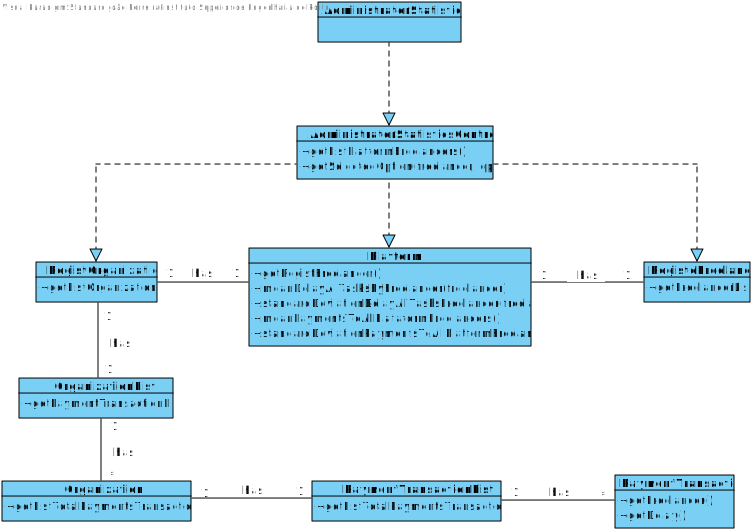

# UC7 - Analyse Freelancer's Statistics

## 1. Requirements engineering

### Brief Format

The administrator starts the analysis of both execution time and payment referred to as the freelancer. The system requests the administrator to choose between one of them. The administrator selects one option. The system shows what the administrator wants and finalizes the process.

### SSD


### Full Format

#### Main actor

* Administrator

#### Stakeholders and their interests

* **Administrator:** wants to see the statistics of the freelancers' performances.
* **T4J:** aims to satisfy organizations and their members by facilitating their desires.

#### Preconditions

* Delays must already exist in the system.
* Payments must already exist in the system.

#### Postconditions
\-

### Main success scenario (or basic flow)

1. The administrator starts the analysis of both execution time and payment referred to as the freelancer.
2. The system requests the administrator to choose between one of them.
3. The administrator selects one option.
4. The system shows what the administrator wants and finalizes the process.

#### Extensions (or alternative flows)

*a. The administrator requests  to cancel the sampling of the information.
> The use case ends.

#### Special requirements
\-

#### List of Technologies and Data Variations
\-

#### Frequency of Occurrence
\-

#### Open questions

* Is there anything else the administrative wants to see?
* How often does this use case occur?

## 2. OO Analysis

### Excerpt from the Relevant Domain Model for UC




## 3. Design - Use Case Realization

### Rational

| Fluxo Principal | Questão: Que Classe... | Resposta  | Justificação  |
|:--------------  |:---------------------- |:----------|:---------------------------- |
| 1. The administrator starts the analysis of both execution time and payment referred to as the freelancer.  |	... interacts with the user? | AdministratorStatisticsUI |  Pure Fabrication: it is not justified to assign this responsibility to any existing class in the Domain Model. |
|  		 |	... coordinates the UC?	| AdministratorStatisticsController | Controller    |
|  		 |	... cria instância de Colaborador?| RegistoColaboradores   | Creator (Regra1)|
|  |...knows the user/administrator using the system? | Platform |IE: cf. user management component documentation.|
| 2. The system requests the administrator to choose between one of them.  |   …knows the options? |      |       |      
| 3. The administrator selects one option.  |	... saves the entered option?  |   Platform  | Info1rmation Expert (IE) - instance created in step 1: it has its own data.     |
| 4. The system shows what the administrator wants and finalizes the process.  | | | |


###Systematization##

It follows from the rational that the conceptual classes promoted to software classes are:

* Platform

Other software classes (i.e. Pure Fabrication) identified:

 * AdministratorStatisticsUI
 * AdministratorStatisticsController

Other classes of external systems / components:
\-

###	Main Sequence Diagram



####	Secondary Sequence Diagrams



!UC7_standardDeviationDelayAllTasksFreelancer_SD.svg](UC7_standardDeviationDelayAllTasksFreelancer_SD.svg)





###	Class Diagram















