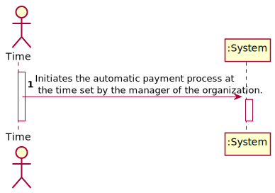
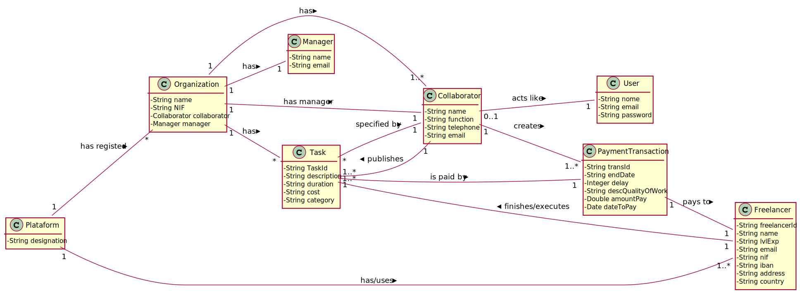


# UC8 - Automatic Payment

## 1. Requirements Engineering

### Brief format

The automatic process of payment starts at the time predefined by the manager of the organization. When the payment is finished, the system registers all the payments in a texto file.

### SSD


### Full format 

#### Main actor

* Time

#### Stakeholders and their interests

* **Manager:** wants the payments made automatically by the system.
* **Freelance:**: wants to get automatically paid.
* **Organization:**wants their payments paid automatically by the system.
* **T4J:** wants to ease the way that payments are made.

#### Preconditions
* The manager needs to define when all the tasks/transactions, that exists  in the system and that have not been paid yet, will be paid.

#### Postconditions
* The application should register all payments, made by all organizations, in a single txt file.

#### Main success scenario (or basic flow)

1.The automatic process of payment starts at the time predefined by the manager of the organization.
2.The system identifies the tasks/transactions that exist in the system and that have not been paid yet.
3.When the payment is finished, the system registers all the payments in a texto file.

#### Extensions (or alternative flow)

2.a. The system didn't found any tasks/transactions in the system.
>The use case ends.

2.b. The system didn't found any tasks/transactions that have not been paid.
>The use case ends.

#### Special requirements

* Every time the preset hour comes and, there is a task/transaction that has not been paid yet.

#### List of Technologies Variations and Data
\-

#### Frequency of Occurrence
\-

#### Open questions

* Would it be relevant to have a warning that the system would give to the manager about not having found any tasks/transactions with the desired characteristics? 

## 2.  OO Analyzes

### Piece of the global modal relevant for the use case



## 3. Design - Execution of the use case

### Racional






