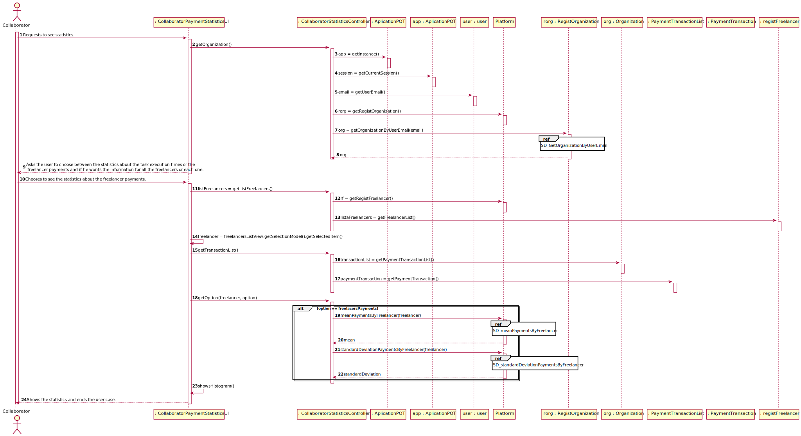
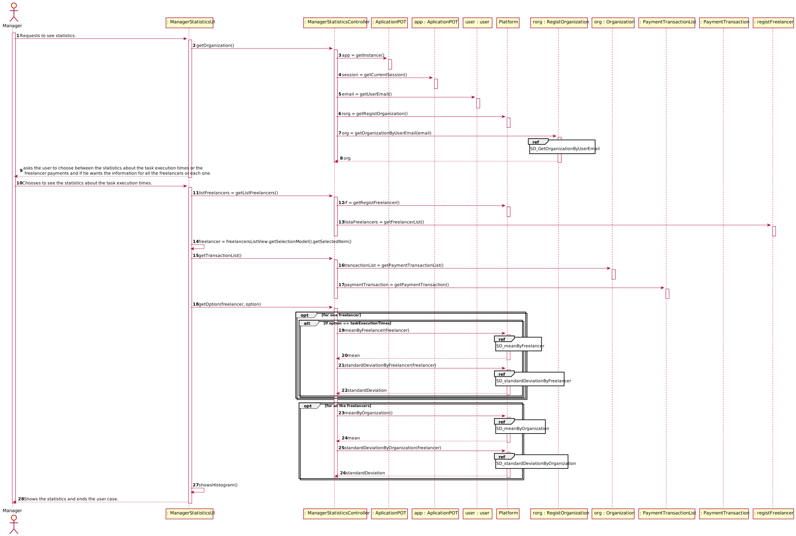
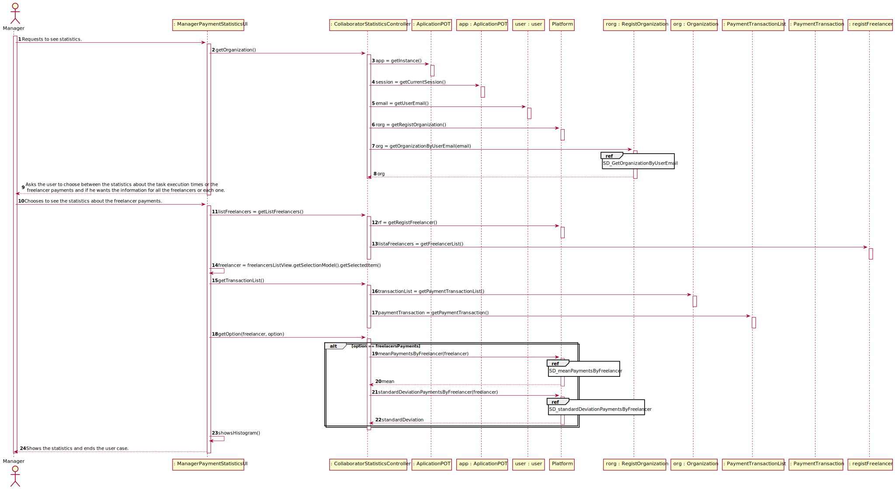
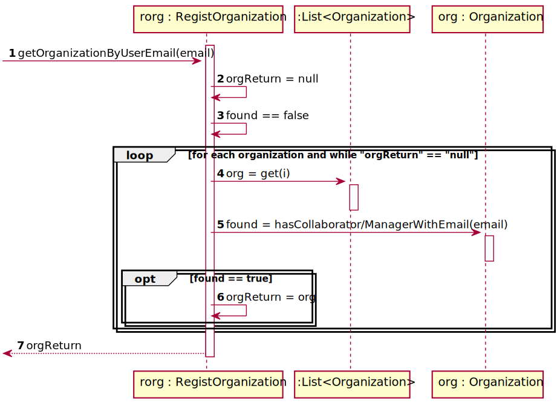
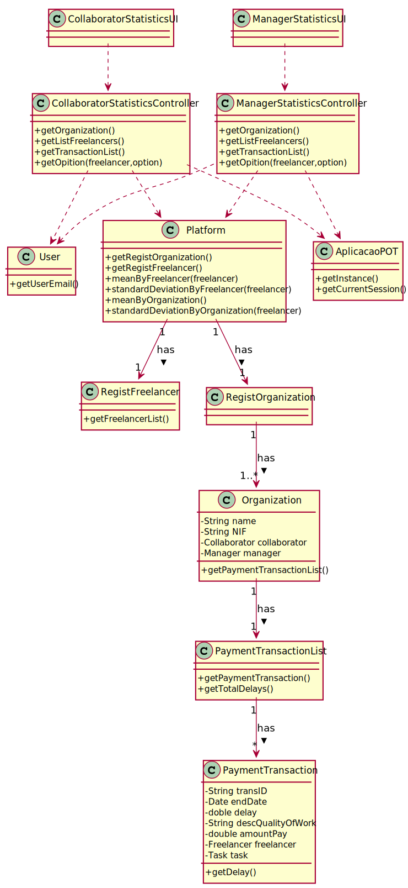
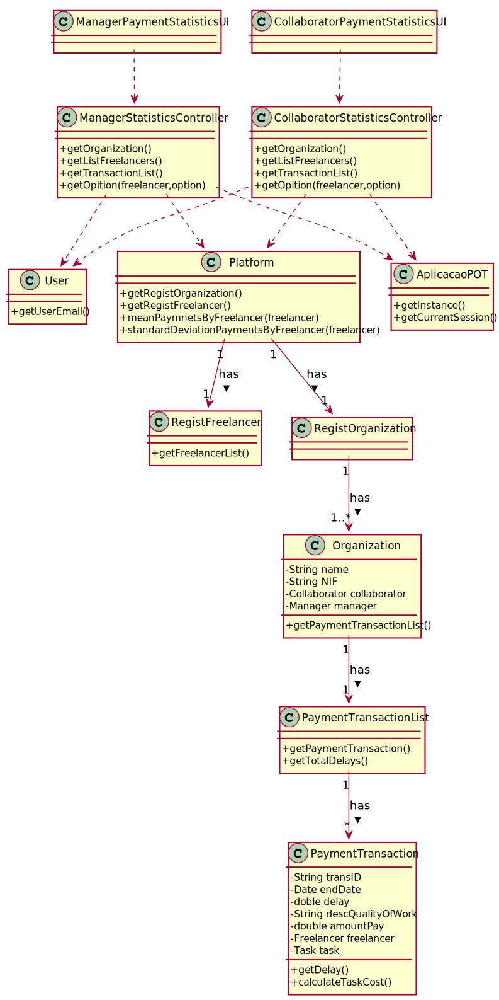


# UC9 - Show Freelancer’s statistics

## 1. Requirements Engineering

### Brief Format

The manager or the collaborator of the organization selects the option of seeing the overall statistics about task execution times (the mean and the standard deviation of the delays, of each one and of all freelancers, and a histogram to analyze the delays of each one and all the freelancers working to the organization) and the freelancer paymemts (the mean and the standard deviation of the payments made to each one of the freelancers). The system asks the user to choose between the statistics about the task execution times or the freelancer payments and if he wants the information for all the freelancers or each one. The manager/ collaborator chooses. The system shows the statistics and finalizes the process. 

### SSD



#### Main Actor

* Manager/Collaborator

#### Stakeholders and their interests

* **Manager/Collaborator :** wants to see the overall statistics about task execution times and freelancers payments.
* **T4J :** intends to show the statistics to the managers and collaborators of their platform.

#### Preconditions

* There needs to exist payments.

#### Postconditions
\-

#### Main success scenario (or basic flow)

1. The manager/collaborator of the organization selects the option of seeing the overall statistics about task execution times (the mean and the standard deviation of the delays, of each one and of all freelancers, and a histogram to analyze the delays of each one and all the freelancers working to the organization) and the freelancer paymemts (the mean and the standard deviation of the payments made to each one of the freelancers).
2. The system asks the user to choose between the statistics about the task execution times or the freelancer payments and if he wants the information for all the freelancers or each one.
3. The manager/collaborator chooses.
4. The system shows the statistics and finalizes the process.

#### Extensions (or alternative flows)

*a. The manager/collaborator wants to cancel the process.
> The use case ends.

#### Special Requirements
\-

#### List of Technologies Variations and Data
\-

#### Frequency of Occurrence
\-

#### Open questions
\-

## 2. Analyze OO

### Piece of the global modal relevant for the use case



## 3. Design - Use Case Realization

### Rational

| Main flow | Question: What Class ... | Answer  | Justification  |
|:--------------  |:---------------------- |:----------|:---------------------------- |
|1. The manage/collaborator of the organization select the option of seeing the overall statistics about task execution times (the mean and the standard deviation of the delays, of each one and of all freelancers, and a histogram to analyze the delays of each one and all the freelancers working to the organization) and the freelancer paymemts (the mean and the standard deviation of the payments made to each one of the freelancers). | ...interacts with the user? | CollaboratorMenuUI I | Pure Fabrication.|
|| ...coordinates the UC? | AplicationControllerController | Controller |
|| ...knows the user / manager using the system? | User | IE: cf. documentation of the user management component. |
|| ...knows to which organization the user belongs to? | RegistOrganization | IE: knows all organization. |
||| Organization | IE: knows all its collaborators. |
|2. The system asks the user to choose between the statistics about the task execution times or the freelancer payments and if he wants the information for all the freelancers or for everyone | | | |
|3. The manager or the collaborator chooses one option. || ...knows all the Freelancers that belong to the user Organization? | PaymentTransaction | In DM Freelancer receives Transaction. |
|| ...knows the delays of every freelancer?| PayementTransaction | In DM Freelancer receives Transaction. |
|| ...knows the payments transactions?| PaymentTransactionsList | By the application of HC + LC to the Organization, the "Organization" pass on that responsability to the "Transactions List". |
|4. The system shows the statistics and finalizes the process. | ...shows the statistics? | CollaboratorStatisticsUI/ManagerStatisticsUI | Pure Fabrication. |
 

### Systematization ##

It follows from the rational that the conceptual classes promoted to software classes are:

 * Platform
 * Task
 * Freelancer
 * Transaction
 * Calculations

Other software classes (i.e. Pure Fabrication) identified :

 * ShowGenerakAnalysisUI  
 * ShowGenerakAnalysisController
 * OrganizationRegistry
 * TransactionList

Other classes of external systems / components:

* User

###	Sequence Diagram

If the collaborator wants to see statistics about task execution times: 



If the collaborator wants to see statistics about the freelancers payments:



If the manager wants to see statistics about task execution times: 



If the manager wants to see statistics about the freelancers payments:






###	Class Diagram

Task execution times :



Freelancers payments:








